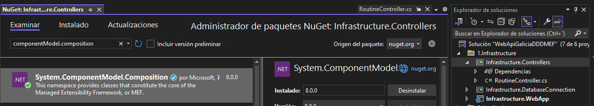

# MANAGED EXTENSIBILITY FRAMEWORK

## Contexto
- MEF es una biblioteca incluida en .NET Framework 4+, e importable en .NET Core, que facilita la creación de aplicaciones extensibles.
- Permite a los desarrolladores de aplicaciones descubrir y utilizar extensiones sin necesidad de configuración manual.
- Las extensiones se escriben como clases independientes y se identifican a través de metadatos declarativos.
- La aplicación principal "descubre" automáticamente las extensiones disponibles y las integra dinámicamente.

## Componentes principales
- Contenedor
- Catálogo
- Partes

## Flujo
El flujo se basa en la composición de las partes exportadas. Una clase se declara como una “parte” mediante una interfaz y se exporta junto con metadata para identificarla. La clase que quiera utilizar estas “partes” puede importar todas las que implementen la interfaz de interés y generar un catálogo, la “parte” de interés al estar identificada por la metadata se puede filtrar del resto y ser utilizada.

## Implementacion
1. Incorporación del paquete System.ComponentModel.Composition
    - Por NuGet en Visual Studio:
    
    - Por consola con dotnet:
        ```
        >dotnet add package System.ComponentModel.Composition
        ```
    - Por referencia directamente en archivo de proyecto(.csproj):
        ```
        <PackageReference Include="System.ComponentModel.Composition" Version="8.0.0" />
        ```

2. Creamos la interfaz de nuestro interés
    ```
    public interface IValidationRoutine
    {
        bool ExecuteRoutine(string clientDocumentNumber);
    }
    ```

3. Creamos la clase que implementa la interfaz
    ```
    public class ValidateDNI : IValidationRoutine
    {
        public bool ExecuteRoutine(string clientDocumentNumber)
        {
            return true;
        }
    }
    ```

4. Agregamos la declaración de la exportación y la metadata, para ello también tendremos que agregar una interfaz de metadata
    ```
    [Export(typeof(IValidationRoutine))]
    [ExportMetadata("Name", "ValidateDNI")]
    public class ValidateDNI : IValidationRoutine
    {
        public bool ExecuteRoutine(string clientDocumentNumber)
        {
            return true;
        }
    }
    ```

    ```
    public interface IValidationRoutineMetadata
    {
        string Name { get; }
    }
    ```

5. Ahora la clase que hará uso de este tipo de “parte”
    ```
    public class MyClass
    {
    [ImportMany(typeof(IValidationRoutine))]
    public List<Lazy<IValidationRoutine, IValidationRoutineMetadata>> ValidationRoutines { get; set; }
        public void LoadRoutine(string routineName,string clientDocumentNumber)
        {
            var catalog = new DirectoryCatalog(@"..\..\Application\Application.Services\obj\Debug\net8.0");
            var container = new CompositionContainer(catalog);
            container.ComposeParts(this);
            var routine = ValidationRoutines.FirstOrDefault(x => x.Metadata.Name == routineName);
            bool routineResult = routine.Value.ExecuteRoutine(clientDocumentNumber);
        }
    }
    ```

